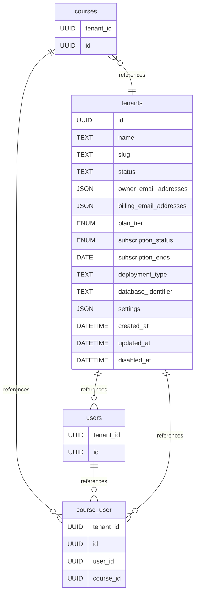

# TrackMe Education

## What is TrackMe Education? 

## How to run locally
This repository uses Docker to run the application locally.

### Prerequisites
- Docker
- Docker Compose

### Steps
1. Clone the repository
2. Run `docker compose up`
3. Access the application at `http://localhost:5173`

## Database model
While TrackMe Education runs on a DynamoDB database in production. The database model below should help you understand the relationships between the different tables.

